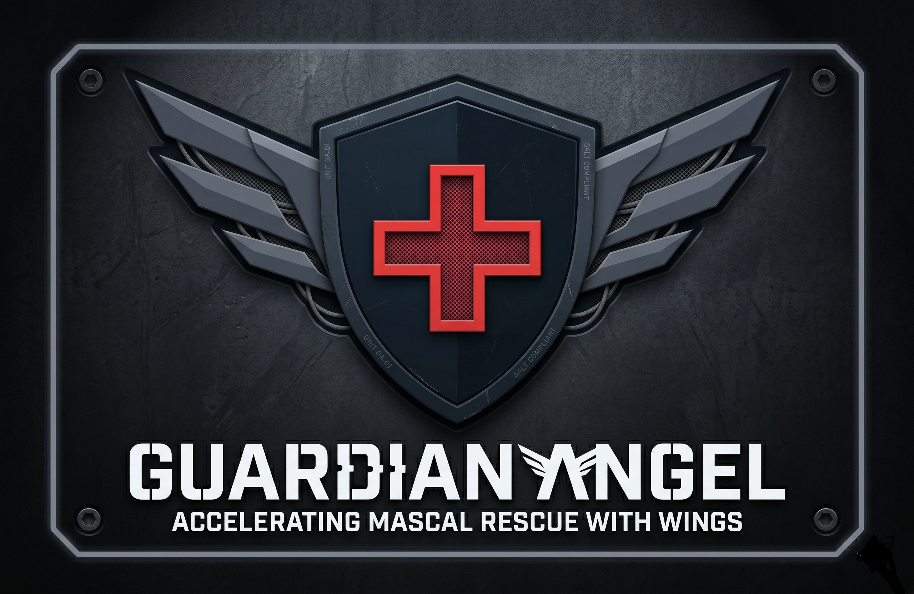

<p align="center">
  
</p>

# Guardian Angel

Console for mascal triage powered by AI.  

For a demo of all Guardian Angel components, including the [AI workflow](https://github.com/starpebble/guardian-angel-workflow) and [voice app](https://github.com/starpebble/guardian-angel-radio-app), please see the demo on YouTube [
Guardian Angel Demo - DC Nat Sec Hackathon](https://www.youtube.com/watch?v=nPirk4-PwYQ).

## Description

Guardian Angel is a multi-user system to accelerate mass casualty search and rescue with AI.
- Guardian Angel Console: A single view into all the knowledge about the scene, updated in real time
- Workflow: An AI powered workflow that accepts photos from drones or people and generates a report sent to the console for automated aggregation
- Voice App: A mobile app for a person medic to share verbal information with Guardian Angel

## Repos

Guardian Angel Components:

1. https://github.com/starpebble/guardian-angel-console
2. https://github.com/starpebble/guardian-angel-radio-app
3. https://github.com/starpebble/guardian-angel-workflow

## Spec

For spec driven development, please see [`GUARDIAN_ANGEL_SPEC.md`](GUARDIAN_ANGEL_SPEC.md) and [`developer.md`](developer.md).  Built with Cursor and OpenAI Codex.

## Documentation

There is setup and Firebase config guidance in [Documentation](documentation/)

## Quick start

Dependencies are managed with **[uv](https://docs.astral.sh/uv/)** (`pyproject.toml` + `uv.lock`).

Install [uv](https://docs.astral.sh/uv/getting-started/installation/) if needed, then from the repository root:

```bash
uv sync
uv run uvicorn guardian_angel.main:app --reload --host 127.0.0.1 --port 8000
```

`uv sync` creates `.venv/` (if missing), installs locked dependencies, and installs this package in editable mode. You can also activate `.venv` and run `uvicorn` directly.

Open [http://127.0.0.1:8000/](http://127.0.0.1:8000/).

## Docker (cloud / production)

```bash
docker build -t guardian-angel .
docker run --rm -p 8080:8080 -e PORT=8080 --env-file .env guardian-angel
```

Cloud Run and many platforms set **`PORT`**; the image listens on **`PORT`** or **`GUARDIAN_ANGEL_PORT`**, default **8000**. Do not bake secrets into the image — inject **`GUARDIAN_ANGEL_API_SECRET`**, Firebase settings, and credential paths at runtime (see [`Firebase_Setup.md`](documentation/Firebase_Setup.md)).

